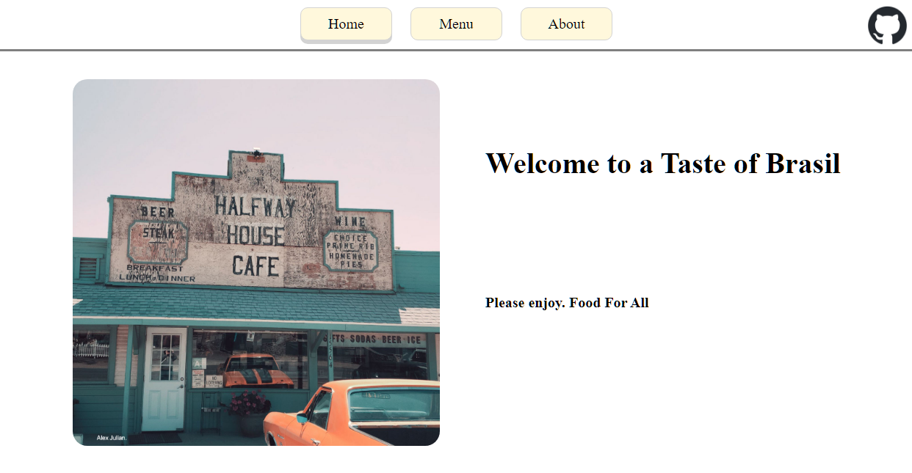
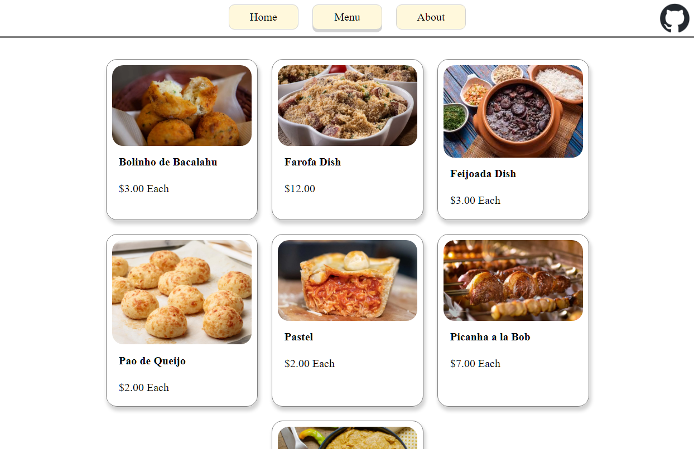

# Project: Restaurant Page - The Odin Project

## Project Overview
This project is a part of The Odin Project curriculum. The main goal of this project is to demonstrate the use of ES6 Modules and Webpack by creating a simple restaurant website with three pages, each page being a separate module.

    
    

<h2 align="center">
<a href="https://lixoten.github.io/restaurant-page-odin/">DEMO</a>
</h2> 

## Features
- **Home Page**: A welcoming page with a restaurant image and a brief introduction.
- **Menu Page**: A page displaying the menu items of the restaurant.
- **About Page**: A page providing information about the restaurant.

## Technologies Used
- **JavaScript (ES6)** - ES6 import and export statements are used extensively to manage and structure the code. Each page of the website (Home, Menu, About) is created as a separate module (in separate JavaScript files), and these modules are imported into the main pageLoad.js file.
- Webpack: Used as a module bundler for this project. It takes the modular JavaScript files, along with any other assets like CSS and images, and bundles them into static assets that can be served to the browser. See Packages Used below.

## Packages Used
If you look at the `package.json` file, the following packages are used in this project:

- `css-loader`: This package is used to load CSS file with webpack.
- `file-loader`: This package is used to import files in JavaScript.
- `gh-pages`: This package is used to publish the site to GitHub pages.
- `html-webpack-plugin`: This package simplifies creation of HTML files to serve your webpack bundles.
- `mini-css-extract-plugin`: This package extracts CSS into separate files. It creates a CSS file per JS file which contains CSS.
- `webpack`: This package bundles JavaScript files for usage in a browser.
- `webpack-cli`: This package provides a flexible set of commands for developers to increase speed when setting up a custom webpack project.
- `webpack-dev-server`: This package is used to quickly develop an application.

### Project Specification
[Project: Restaurant Page at The Odin Project](https://www.theodinproject.com/lessons/node-path-javascript-restaurant-page)

### Notes
Simple single-page application (SPA)  
For more notes please see my notes doc. [Notes](./assets/docs/notes.md)
